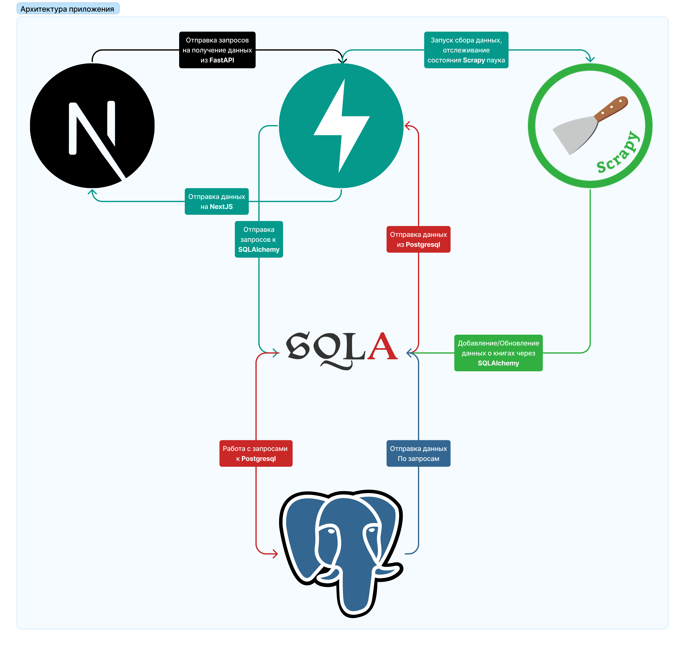
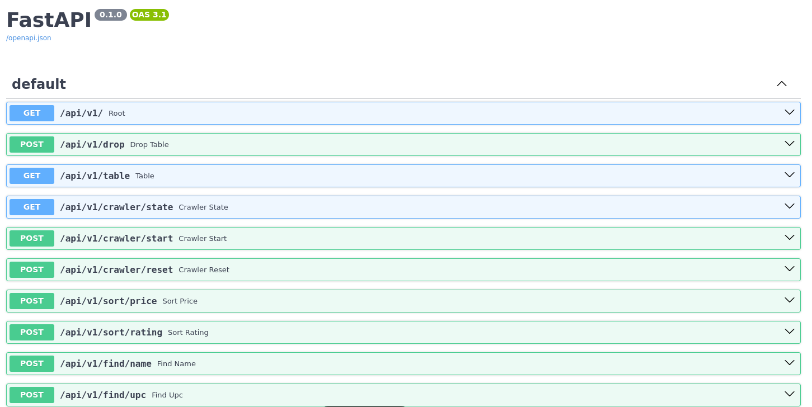
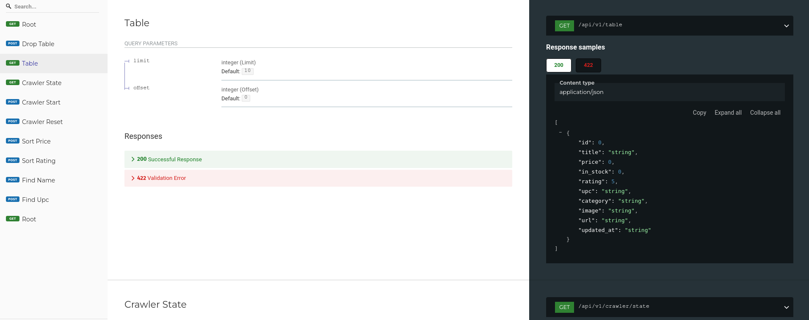
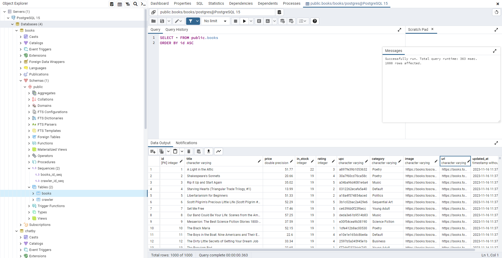

# Project Books


**Project Books** это проект, построенный на основе [Python](https://www.python.org/)
and [Next.js](https://nextjs.org/), который предназначен для сбора, сортировки и поиска различных книг со
скрейпинг-песочницы [books.toscrape.com](https://books.toscrape.com/) от [Zyte](https://www.zyte.com/).

**Главная цель данного проекта** явно не в получении полезной информации, а в правильном проектировании системы сбора,
хранения и обработки данных.

> Заметка: сайт [books.toscrape.com](https://books.toscrape.com/)
> является собственностью [Zyte](https://www.zyte.com/). Project Books не является
> партнером [Zyte](https://www.zyte.com/) и производит сбор только тех данных, на которые автор дал свое согласие.

## Содержание

- [Возможности графического интерфейса](#возможности-графического-интерфейса)
- [Установка и настройка](#установка-и-настройка)
- [Карта проекта](#карта-проекта)
- [Архитектура проекта](#архитектура-проекта)
- [Дерево целей проекта](#дерево-целей)
- [Структура проекта](#структура-проекта)
- [Работа FastAPI](#работа-fastapi)
- [Работа Scrapy](#работа-со-scrapy)
- [Дополнения](#дополнения)
    - [PGAdmin](#pgadmin)
- [Заключение](#заключение)

## Возможности графического интерфейса

На видео можно увидеть возможности приложения


[Открыть файлом](assets/workflow.mp4) (Если не работает embedded)

## Установка и настройка

Клонируем репозиторий

```commandline
git clone https://github.com/revolexGeek/project-books.git
```

Заходим в папку

```commandline
cd project-books
```

Запускаем файл `build.sh`, который делает всю работу за нас

```commandline
sudo bash build.sh
```

Данный файл произведет установку `Docker` и `Docker-Compose`, а также произведет запуск контейнеров.

Исходный код можно посмотреть здесь: [build.sh](build.sh)

## Карта проекта

Здесь представлена карта завершенности данного проекта.

- [x] Моделирование архитектуры приложения
- [x] Построение дерева целей
- [x] Построение предметной области
- [x] Создание дизайна для веб-интерфейса
- [x] Верстка дизайна на Next JS
- [x] Создание Scrapy паука
- [x] Реализация моделей данных
- [x] Построение API-путей
- [x] Контейнеризация приложения
- [x] Оформление README.md

## Архитектура проекта



На данной диаграмме можно увидеть следующие потоки данных:

### Отрисовка данных в графическом интерфейсе

- От `Next JS` создается запрос определенных данных из базы данных
- `FastAPI` при помощи `SQLAlchemy` отбирает данные из `Postgresql`
- `FastAPI` отдает нужные данные `Next JS`

### Отслеживание состояния Scrapy паука и воспроизведение сбора данных

- На `FastAPI` поступает запрос на начатие сбора данных от `Next JS`
- `FastAPI` запускает `Scrapy` паука, меняя состояние паука на `running`
- После успешного сбора данных `Scrapy` паук меняет свое состояние на `waiting`

### Добавление новых предметов / обновление имеющихся при помощи Scrapy паука

- `Scrapy` паук собирает данные со страниц [books.toscrape.com](https://books.toscrape.com)
- `Scrapy` паук форматирует полученные данные с веб-страницы
- `Scrapy` паук получает предмет в `Item Pipeline`, отслеживает, имеется ли такой предмет и добавляет/обновляет его в
  базу(е) данных при помощи `SQLAlchemy`

## Дерево целей проекта


[Открыть в полный размер](assets/Objectives%20tree.png)

## Структура проекта

```text
 ├──backend     (часть с FastAPI и Scrapy пауком)
 │  ├──crawler
 │  ├──database
 │  └──routers
 └──frontend    (часть с проектом Next JS)
    ├──app
    ├──node_modules
    └──public
```

## Работа FastAPI

Получить документацию по всем реализованным путям можно запустив проект и перейдя по одной из ссылок

`OpenAPI`:
[/docs](http://localhost:8000//docs)



`ReDOC`:
[/redoc](http://localhost:8000/redoc)



Все алгоритмы работы можно увидеть здесь:

`Routes`: [backend/routers/v1.py](backend/routers/v1.py)

`CRUD`: [backend/database/crud.py](backend/database/crud.py)

## Работа со Scrapy

Изначально, у нас имеется следующий паук:

```python
class BookSpider(scrapy.Spider):
    name = "book"

    def start_requests(self):
        """ Точка входа """
        yield scrapy.Request(
            url="https://books.toscrape.com/",
            callback=self.parse_page
        )

    def parse_book(self, response):
        """ Получение данных о книге, на странице книги """
        item = Book()

        item['title'] = response.css('div.col-sm-6.product_main > h1::text').get()
        item['image'] = "https://books.toscrape.com/" + response.css(".item.active img::attr(src)").get()
        item['price'] = response.css('p.price_color::text').get()
        item['rating'] = response.css('p.star-rating::attr(class)').get()
        item['url'] = response.request.url

        for row in response.css("table.table.table-striped").css("tr"):
            if row.css("th::text").get() == "UPC":
                item['upc'] = row.css("td::text").get()
            if row.css("th::text").get() == "Availability":
                item['in_stock'] = row.css("td::text").get()

        item['category'] = response.css("ul.breadcrumb").css("a")[-1].css("::text").get()
        item['updated_at'] = datetime.datetime.utcnow()

        yield item

    def parse_page(self, response):
        """ Сбор страниц с книгами """
        for book in response.css("article.product_pod"):
            url = book.css("div.image_container > a::attr(href)").get()
            if 'catalogue' not in url:
                url = "https://books.toscrape.com/catalogue/" + url
            else:
                url = "https://books.toscrape.com/" + url
            yield scrapy.Request(url=url, callback=self.parse_book)

        next_page = LinkExtractor(restrict_css='.next a').extract_links(response)[0]
        if next_page is not None:
            yield response.follow(next_page, callback=self.parse_page)

    @classmethod
    def from_crawler(cls, crawler, *args, **kwargs):
        """ Установка сигнала о завершении """
        spider = super(BookSpider, cls).from_crawler(crawler, *args, **kwargs)
        crawler.signals.connect(spider.spider_closed, signal=signals.spider_closed)
        return spider

    def spider_closed(self, spider):
        """ Закрытие паука, отправка запроса на API """
        session = Session()
        try:
            change_spider_state(session, "waiting")
        except:
            # ...
            pass
        finally:
            session.close()
```

Алгоритм его работы:


Форматирование предмета:

```python
class BooksRefactorPipeline:
    def __init__(self):
        self.ratings = {
            "one": 1,
            "two": 2,
            "three": 3,
            "four": 4,
            "five": 5
        }

        self.in_stock_regex = r"\((\d+)\savailable\)"

    def process_item(self, item, spider):
        """ Форматирование данных """
        adapter = ItemAdapter(item)

        price = adapter["price"]
        price = float(price.replace("£", ""))
        rating = self.ratings[adapter["rating"].split()[-1].lower()]

        in_stock = adapter["in_stock"]
        match = re.search(self.in_stock_regex, in_stock)
        if match:
            in_stock = match.group(1)
        else:
            raise DropItem(f"Missing in_stock in {item}")

        adapter["price"] = price
        adapter["in_stock"] = in_stock
        adapter["rating"] = rating

        return item
```

Работа с базой данных:

```python
class BooksPipeline:
    def __init__(self):
        """ Инициализирование подключения к базе данных """
        engine = db_connect()
        self.Session = sessionmaker(bind=engine)

    def process_item(self, item, spider):
        """ Сохранение книг в БД """
        session = self.Session()

        found_book = is_book_exists(session, item["url"])
        if found_book:
            found_book.title = item["title"]
            found_book.price = item["price"]
            found_book.in_stock = item["in_stock"]
            found_book.rating = item["rating"]
            found_book.upc = item["upc"]
            found_book.category = item["category"]
            found_book.image = item["image"]
            found_book.url = item["url"]
            found_book.updated_at = item["updated_at"]
            try:
                session.commit()
                session.refresh(found_book)
            except:
                session.rollback()
                raise
            finally:
                session.close()
        else:
            book = Book()
            book.title = item["title"]
            book.price = item["price"]
            book.in_stock = item["in_stock"]
            book.rating = item["rating"]
            book.upc = item["upc"]
            book.category = item["category"]
            book.image = item["image"]
            book.url = item["url"]
            book.updated_at = item["updated_at"]

            try:
                session.add(book)
                session.commit()
            except:
                session.rollback()
                raise
            finally:
                session.close()

        return item
```

## Дополнения

Для удобства дебаггинга проекта была установлена панель управления БД: `PGAdmin`

### PGAdmin

С помощью данного инструмента удобно просматривать изменения в базе данных



## Заключение

Используя фреймворк Scrapy, проект автоматически проходит по всем страницам сайта, собирает информацию о книгах и
сохраняет ее в базу данных PostgreSQL с помощью SQLAlchemy ORM.

Также, проект использует Next JS для реализации графического интерфейса, который обеспечивает удобный способ
взаимодействия с данными. FastAPI используется для обработки входящих запросов и работы с базой данных через также через
SQLAlchemy ORM.

С помощью Books Project открылись следующие возможности:

- Дистанционный запускать паука
- Получение таблицы собранных книг
- Сортировка книги по рейтингу или цене
- Поиск по уникальному идентификатору (UPC) или названию книги

Также, важно отметить, что вся структура проекта организована в виде микросервисов и легко разворачивается с
использованием Docker-compose (или же
build.sh файла).

